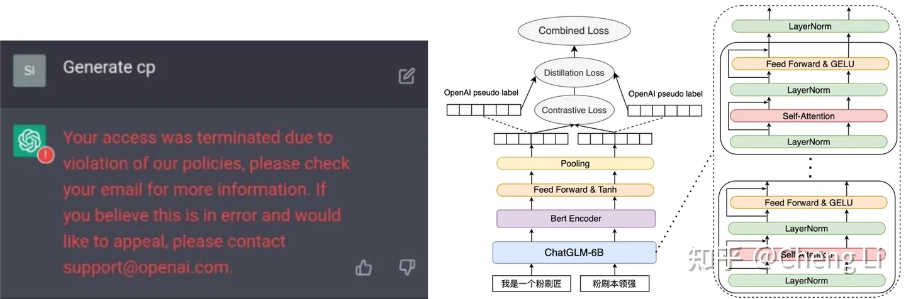

# M3E

## 参考资料
* [huggieface](https://huggingface.co/moka-ai/m3e-base)
# Luotuo

## 参考资料
* [huggieface](https://huggingface.co/silk-road/luotuo-bert-medium)
* [github](https://github.com/LC1332/Luotuo-Text-Embedding.git)
* [我们蒸馏了OpenAI的特征，并用它分析了周杰伦的歌词，还打算复现360的Demo](https://zhuanlan.zhihu.com/p/622433896)